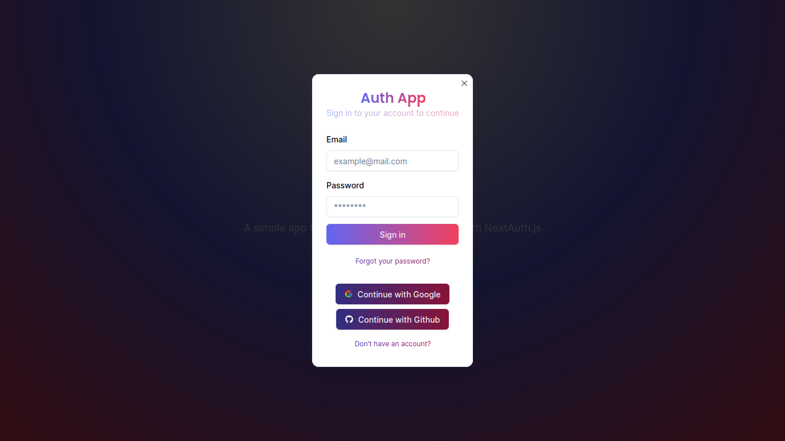
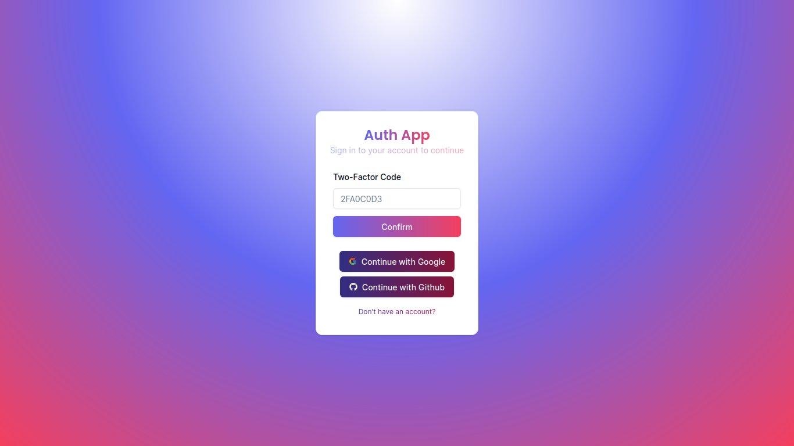
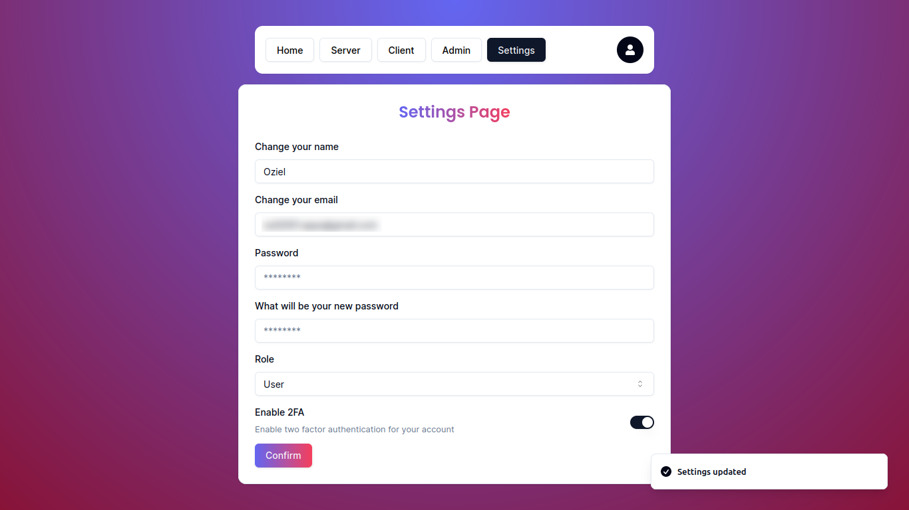
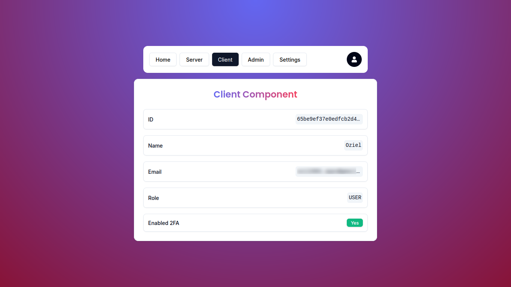
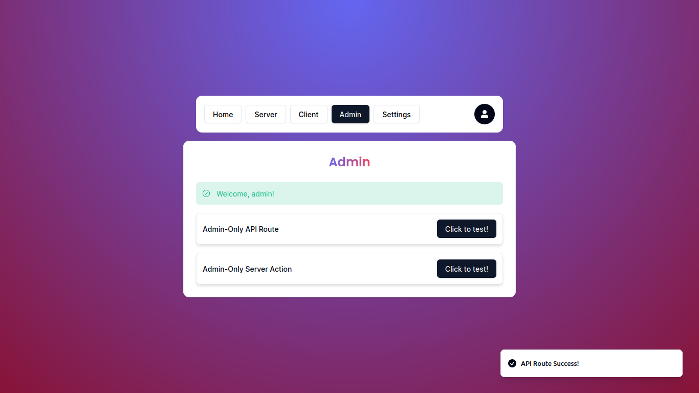

# Auth App (using [NextAuthV5](https://authjs.dev/getting-started/introduction))

## Thanks to [CodeWithAntonio](https://www.codewithantonio.com/)

I'm following his tutorial about [Next Auth V5](https://www.codewithantonio.com/projects/auth-masterclass) for authentication on Web Apps.

## Overview

The application has features for authentication users by email. You can't sign in with email because I didn't add a real email provider for that, but you can try it out with your GitHub or Google account.

### Sign in

### Authentication

### Settings

### Server & Client components

### Admin page

