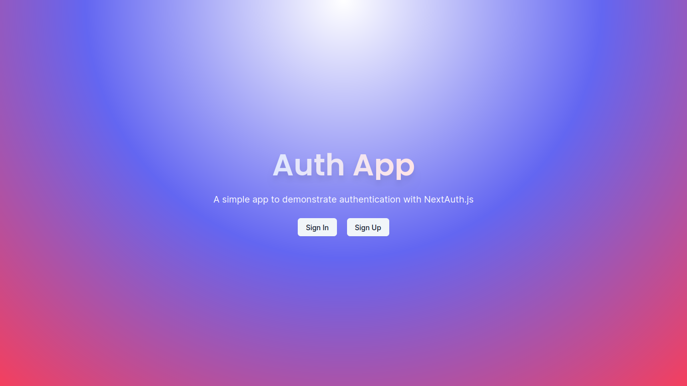
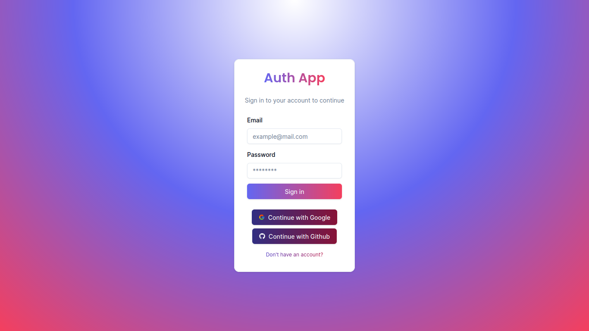
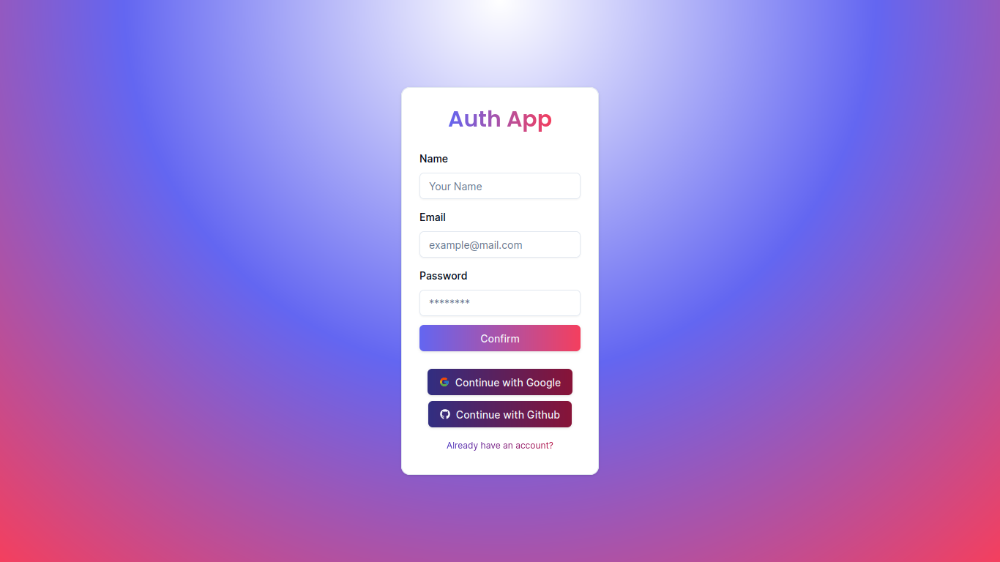

# Auth App (using [NextAuthV5](https://authjs.dev/getting-started/introduction))

## Thanks to [CodeWithAntonio](https://www.codewithantonio.com/)

I'm following his tutorial about [Next Auth V5](https://www.codewithantonio.com/projects/auth-masterclass) for authentication on Web Apps.

## Overview

Auth App is a web application that provides users (so far) a sign-in and sign-up experience. It features a visually appealing landing page and intuitive navigation.

## Features

### Sign In

Existing users can sign in to the app using their credentials. The sign-in page is designed for ease of use, and if there are any issues with the user's credentials, they will receive an error message.

### Sign Up

New users can create an account using the sign-up page. The sign-up process is straightforward, and users will receive a confirmation message once their account is successfully created.

## Future Improvements

Work is ongoing to add more features and improve the user experience.
